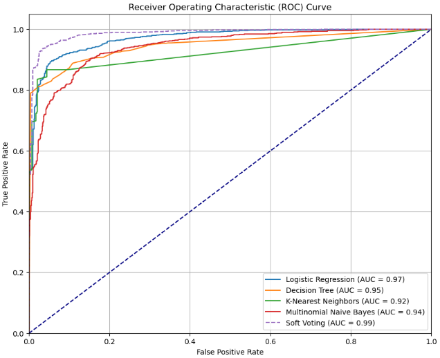
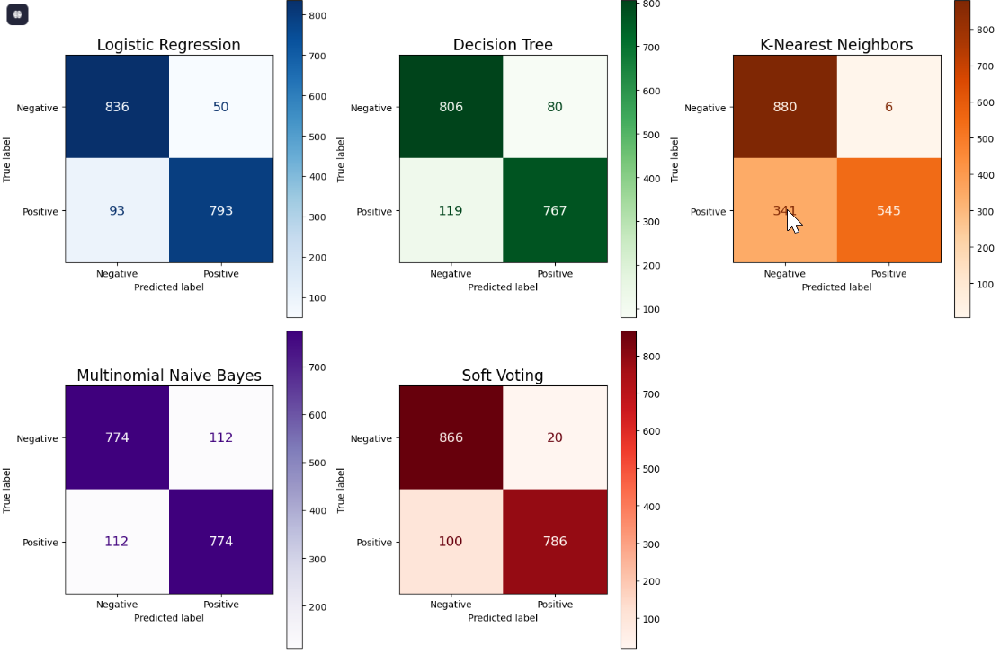
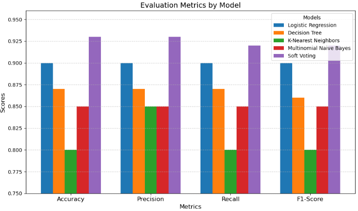

# 🐦 Twitter Sentiment Analysis using Ensemble Majority Voting

This project performs binary sentiment classification (positive vs. negative) on Twitter data using ensemble learning. The goal is to evaluate whether **ensemble majority voting** outperforms single classifiers.

## 🎯 Project Goals
- Perform sentiment classification using machine learning.
- Compare ensemble vs. individual classifiers.
- Demonstrate the benefit of ensemble voting in binary text classification.

## 🗂️ Dataset

- Source: Twitter (scraped using `snscrape`)
- Format: CSV
- Size: ~10,000 tweets
- Features:
  - `created_at`: Timestamp of tweet
  - `text`: Raw tweet content
  - `label`: Sentiment label (positive/negative)

## ⚙️ Workflow

1. [**Preprocessing**](./Code/Preprocessing.ipynb)
   - Case folding
   - Tokenization
   - Stopword removal
   - Stemming

2. [**Labeling**](./Code/Labeling.ipynb)
   - Lexicon-based sentiment labeling (positive / negative)

3. [**Feature Extraction**](./Code/feature_extraction.ipynb)
   - TF-IDF Vectorization

4. [**Modeling**](./Code/modeling.ipynb)
  - Base classifiers: `MultinomialNB`, `LogisticRegression`, `DecisionTree`, `KNN`
  - Ensemble Voting Classifiers: `Soft Voting`
5. ]**Evaluation**](./Code/modeling.ipynb)
   - 5-fold Stratified Cross Validation
   - Metrics: ROC-AUC, Confusion Matrix, Accuracy, Logistic Loss

## 📊 Evaluation Results
### 🧪 ROC-AUC Curve
Ability to separate classes. Soft Voting outperformed all base classifiers.

### 📉 Confusion Matrix 
Shows prediction accuracy for each class. Soft Voting had the most balanced prediction result with the fewest misclassifications.

### 📋 Classification Report 
Soft Voting consistently achieved the best precision, recall, and F1-score.

### 📉 Logistic Loss 
Measures probability accuracy of predictions. Lower Log Loss indicates better-calibrated probability predictions. 

| Model                     | Log Loss |
|--------------------------|----------|
| Logistic Regression      | 0.241    |
| Decision Tree            | 1.528    |
| K-Nearest Neighbor       | 1.409    |
| Multinomial Naïve Bayes  | 0.400    |
| Soft Majority Voting     | 0.247    |

## 💡 Insights

- Soft Voting Ensemble consistently outperformed all base classifiers, showcasing the advantage of ensembling in sentiment classification tasks.
- Logistic Regression was the best-performing single model, but the ensemble approach provided better generalization and slightly lower Log Loss.
- Simpler models like Decision Tree and K-Nearest Neighbors performed poorly, while Multinomial Naïve Bayes showed moderate performance.

## 📊 Tools & Libraries

- `Python 3.12.7`
- `Jupyter Notebook`
- `Scikit-learn`, `NLTK`, `Sastrawi` (Indonesian NLP)
- `Pandas`, `NumPy`, `Matplotlib`, `Seaborn`

## ✅ Conclusion

This project successfully implemented a sentiment analysis pipeline for Twitter data using a lexicon-based labeling and machine learning models. Among the evaluated models, Soft Voting Ensemble provided the best balance between performance and stability. The results demonstrate that combining classifiers can outperform or match the best individual model in binary sentiment tasks, making ensemble methods a practical choice for social media sentiment analysis.

